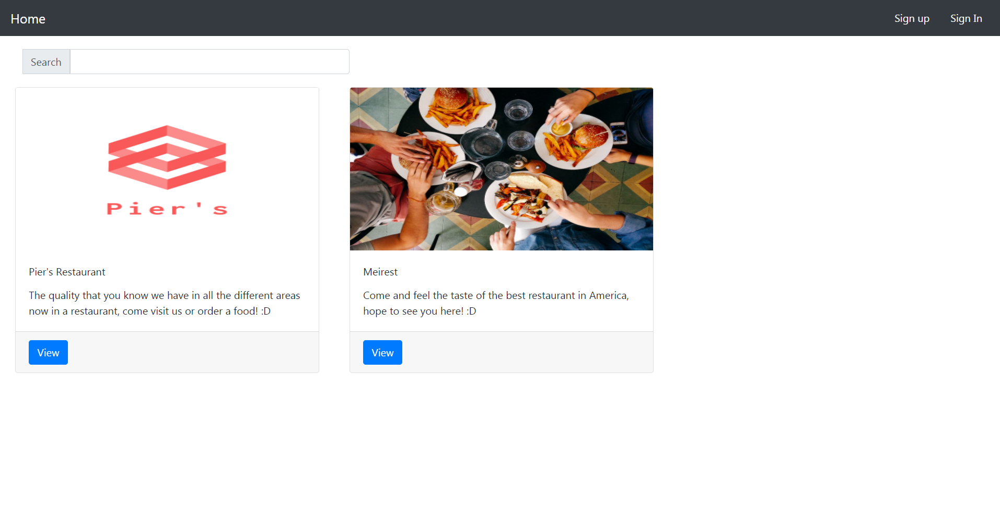
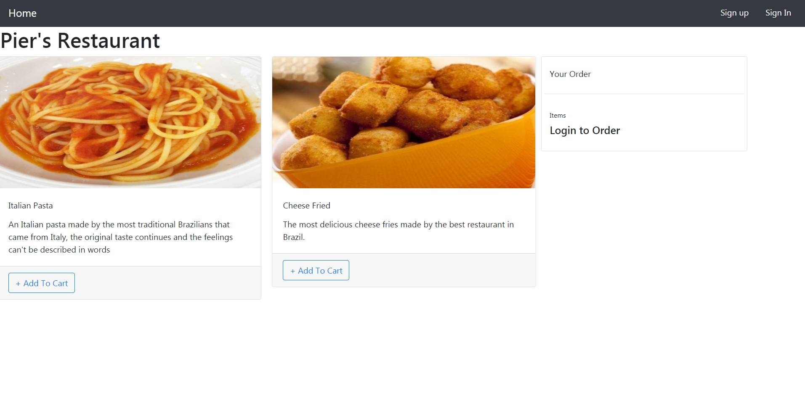
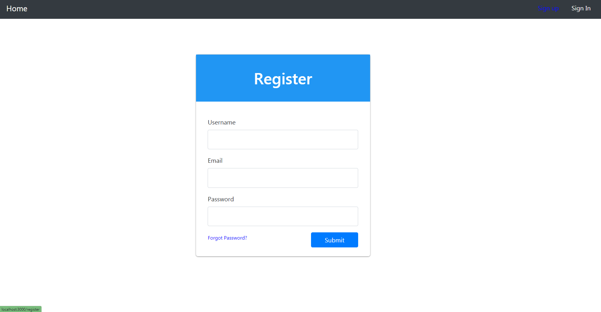
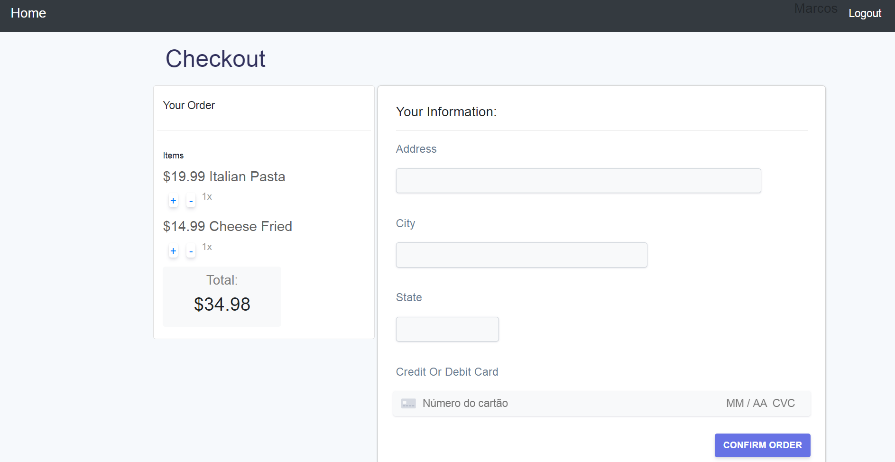

# Email Manager

### Project made with Next.js and Strapi, this app allow you to see a list of restaurants, see the list of dishes of each restaurant and order a dish, this project was made in a tutorial here: <a href="https://strapi.io/blog/nextjs-react-hooks-strapi-food-app-1">click here</a>

<p>
  
  <a href="#" target="_blank">
    
  </a>
  <a href="https://twitter.com/Lucianompjr" target="_blank">
    
  </a>
</p>

# Usage Front-End

First Install the components with

```
npm install
# or
yarn add

```

Then run with

```
npm run dev
# or
yarn dev

```

# Usage Back-End

First install the dependencies with

```
npm run develop
# or
yarn develop
```

Then run with

```
npm run dev
# or
yarn dev
```

# Screenshots





